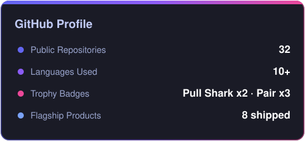
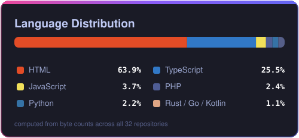

<div align="center">


<a href="https://git.io/typing-svg"></a>

</div>

## About Me

I'm a full-stack engineer who **ships end-to-end products** — the kind with real users, real payments, and real infrastructure. My work spans from **Go/Rust desktop vaults** to **production SaaS platforms** running on PM2 behind Cloudflare. I don't stop at "it works on my machine": I handle the payment flows, the SMTP deliverability, the race conditions, and the auto-update signing pipelines.

```yaml
name: Musfiqur Rahman Saimon
role: Full-Stack Product Engineer
location: Bangladesh
focus: Shipping complete, production-grade products
philosophy: "Paper-trade it, test it, then deploy it"
currently_building: AI-powered tooling & agent integrations (MCP)
```

---

## Featured Products

| Project | What it does | Stack |
|---------|-------------|-------|
| 🔐 [**AHS Vault**](https://github.com/britsync07-prog/ahs-app) | Zero-knowledge biometric vault — AES-256-GCM chunked storage unlocked by paired phone / WebAuthn | `Go` `Rust/Tauri` `React PWA` `Kotlin` |
| 📊 [**BritCRM**](https://github.com/britsync07-prog/crm) | Self-hosted all-in-one CRM with LiveKit meetings, team chat, billing + MCP server for AI agents *(live in production)* | `Next.js 16` `Socket.io` `Prisma` `LiveKit` |
| 💳 [**BlackDesck**](https://github.com/britsync07-prog/stripepay) | Consultation platform with Stripe Connect payouts & risk-based 3DS checkout | `Laravel` `Inertia` `React` `Stripe` |
| 📈 [**BritTrade AI**](https://github.com/britsync07-prog/britTrade) | Crypto signal engine with automated Binance futures execution, paper/live parity & Android app | `Node.js` `CCXT` `Capacitor` `Kotlin` |
| 🎬 [**BritTube**](https://github.com/britsync07-prog/BritTube) | AI video generation pipeline — script → footage → TTS → subtitles → MP4, with public API & MCP server | `FastAPI` `MoviePy` `Next.js` `MCP` |
| 🎰 [**WinyPay Client**](https://github.com/britsync07-prog/bdclient011) | Gaming platform with seamless-wallet integration & custom payment gateway | `Next.js 15` `Express` `Prisma` |
| ✉️ [**MailSender**](https://github.com/britsync07-prog/mailsender) | Postal-style multi-tenant MTA infrastructure — DKIM/SPF automation, warmup engine, 100k/day design | `TypeScript` `SMTP` `PostgreSQL` `Redis` |
| 🎯 [**LeadHunter**](https://github.com/britsync07-prog/testingit) | B2B lead-gen platform — stealth scraping queue, segmented newsletters, HMAC tracking pixels | `Puppeteer` `SQLite` `Stripe` |

---

## Tech Arsenal

<div align="center">


</div>

**Deep-work areas:** Payment integrations (Stripe/PayPal · idempotent webhooks · 3DS/SCA) · Email infrastructure (SMTP relays · DKIM/SPF · warmup · deliverability) · Realtime systems (Socket.io · LiveKit SFU) · Desktop apps (Tauri/Rust · signed auto-updaters) · AI agent surfaces (MCP servers)

---

## GitHub Stats

<div align="center">

|  |  |
|:---:|:---:|

<sub><b>Self-hosted stat cards</b> computed from live GitHub API data — no third-party widgets, never rate-limited, always renders.</sub>

</div>

---

## How I Work

<div align="center">


&nbsp;
➜&nbsp;

&nbsp;
➜&nbsp;

&nbsp;
➜&nbsp;


</div>

Every repo in my profile has a documented engineering story — real bugs found, real fixes shipped:

- **Race conditions** caught in live capital checks before they cost money
- **Idempotent payment recording** so webhooks never double-charge
- **Signed update pipelines** that survive trust-chain rotations
- **SMTP reputation strategy** separating transactional from bulk mail

> Browse any repository — each README documents the challenges faced and how they were solved.

---

<div align="center">

### Let's Build Something

<a href="mailto:saimon@britsyncai.com"></a>
&nbsp;
<a href="https://github.com/britsync07-prog"></a>


</div>


